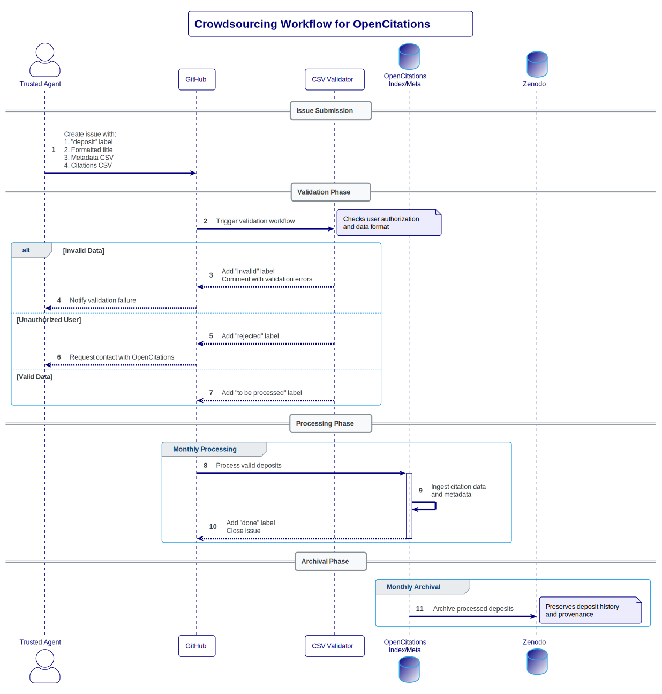

# Crowdsourcing

[](http://opencitations.net)
[](https://github.com/opencitations/crowdsourcing/actions/workflows/tests.yaml)


In this repository, trusted agents can deposit citations and bibliographic metadata for publication through [OpenCitations Index](https://opencitations.net/index) and [OpenCitations Meta](https://opencitations.net/meta).

## Workflow Overview

The following diagram illustrates the complete workflow of the crowdsourcing process:



## How to make a deposit

1. Create a new issue in this repository
2. Format your issue title as: `deposit {domain name of journal} {identifier}`
   - For example: `deposit localhost:330 doi:10.1007/978-3-030-00668-6_8`
   - Supported identifiers: doi, isbn, pmid, pmcid, url, wikidata, wikipedia, and openalex
3. In the issue body, include:
   - Your metadata CSV
   - The separator `===###===@@@===`
   - Your citations CSV

The automated system will:
1. Check if you are in the safe list
2. Validate your data format
3. If invalid, add the "invalid" label, comment with validation errors, and close the issue
4. If valid:
   - Add the "to be processed" label
   - Process and ingest your deposit during the next monthly update
   - Update the label to "done" after processing

An example can be found at https://github.com/opencitations/crowdsourcing/issues/1

**issue:title**

The title of the issue must be in the following format: "deposit {domain name of journal} {doi or other identifier}". For example "deposit localhost:330 doi:10.1007/978-3-030-00668-6_8". The following identifiers are currently supported: doi, issn, isbn, pmid, pmcid, url, wikidata, and wikipedia.

**issue:body**

The body consists of the metadata of the article and the citations in CSV. The two CSVs must be separated by "===###===@@@===". See example below.

```
"id","title","author","pub_date","venue","volume","issue","page","type","publisher","editor"
"doi:10.1007/978-3-662-07918-8_3","Influence of Dielectric Properties, State, and Electrodes on Electric Strength","Ushakov, Vasily Y.","2004","Insulation of High-Voltage Equipment [isbn:9783642058530 isbn:9783662079188]","","","27-82","book chapter","Springer Science and Business Media LLC [crossref:297]",""
"doi:10.1016/0021-9991(73)90147-2","Flux-corrected transport. I. SHASTA, a fluid transport algorithm that works","Boris, Jay P; Book, David L","1973-01","Journal of Computational Physics [issn:0021-9991]","11","1","38-69","journal article","Elsevier BV [crossref:78]",""
"doi:10.1109/20.877674","An investigation of FEM-FCT method for streamer corona simulation","Woong-Gee Min, ; Hyeong-Seok Kim, ; Seok-Hyun Lee, ; Song-Yop Hahn, ","2000-07","IEEE Transactions on Magnetics [issn:0018-9464]","36","4","1280-1284","journal article","Institute of Electrical and Electronics Engineers (IEEE) [crossref:263]",""
"doi:10.1109/tps.2003.815469","Numerical study on influences of barrier arrangements on dielectric barrier discharge characteristics","Woo Seok Kang, ; Jin Myung Park, ; Yongho Kim, ; Sang Hee Hong, ","2003-08","IEEE Transactions on Plasma Science [issn:0093-3813]","31","4","504-510","journal article","Institute of Electrical and Electronics Engineers (IEEE) [crossref:263]",""
"temp:1","Spatial Distribution of Ion Current Around HVDC Bundle Conductors","Zhou, Xiangxian; Cui, Xiang; Lu, Tiebing; Fang, Chao; Zhen, Yongzan","2012-01","IEEE Transactions on Power Delivery [issn:0885-8977 issn:1937-4208]","27","1","380-390","journal article","Institute of Electrical and Electronics Engineers (IEEE) [crossref:263]",""
"doi:10.1007/978-1-4615-3786-1_11","The Solution of the Continuity Equations in Ionization and Plasma Growth","Davies, A. J.; Niessen, W.","1990","Physics and Applications of Pseudosparks [isbn:9781461366874 isbn:9781461537861]","","","197-217","book chapter","Springer Science and Business Media LLC [crossref:297]",""
"doi:10.1088/0022-3727/13/1/002","Discharge current induced by the motion of charged particles","Sato, N","1980-01-14","Journal of Physics D: Applied Physics [issn:0022-3727 issn:1361-6463]","13","1","3-6","journal article","IOP Publishing [crossref:266]",""
"doi:10.1109/27.106800","Particle-in-cell charged-particle simulations, plus Monte Carlo collisions with neutral atoms, PIC-MCC","Birdsall, C.K.","1991-04","IEEE Transactions on Plasma Science [issn:0093-3813]","19","2","65-85","journal article","Institute of Electrical and Electronics Engineers (IEEE) [crossref:263]",""
"doi:10.1016/0021-9991(79)90051-2","Fully multidimensional flux-corrected transport algorithms for fluids","Zalesak, Steven T","1979-06","Journal of Computational Physics [issn:0021-9991]","31","3","335-362","journal article","Elsevier BV [crossref:78]",""
"doi:10.1088/0022-3727/39/14/017","Diffusion correction to the Raether–Meek criterion for the avalanche-to-streamer transition","Montijn, Carolynne; Ebert, Ute [orcid:0000-0003-3891-6869]","2006-06-30","Journal of Physics D: Applied Physics [issn:0022-3727 issn:1361-6463]","39","14","2979-2992","journal article","IOP Publishing [crossref:266]",""
"doi:10.1007/978-3-663-14090-0 isbn:9783528085995 isbn:9783663140900","High-Voltage Insulation Technology","Kind, Dieter; Kärner, Hermann","1985","","","","","book","Springer Science and Business Media LLC [crossref:297]",""
"temp:2","Space-charge effects in high-density plasmas","Morrow, R","1982-06","Journal of Computational Physics [issn:0021-9991]","46","3","454-461","journal article","Elsevier BV [crossref:78]",""
"doi:10.1007/s42835-022-01029-y","Numerical Simulation of Gas Discharge Using SUPG-FEM-FCT Method with Adaptive Mesh Refinement","Choi, Chan Young; Park, Il Han [orcid:0000-0002-9383-6856]","2022-02-28","Journal of Electrical Engineering & Technology [issn:1975-0102 issn:2093-7423]","17","3","1873-1881","journal article","Springer Science and Business Media LLC [crossref:297]",""
===###===@@@===
"citing_id","cited_id"
"doi:10.1007/s42835-022-01029-y","doi:10.1007/978-3-662-07918-8_3"
"doi:10.1007/s42835-022-01029-y","doi:10.1016/0021-9991(73)90147-2"
"doi:10.1007/s42835-022-01029-y","doi:10.1109/20.877674"
"doi:10.1007/s42835-022-01029-y","doi:10.1109/tps.2003.815469"
"doi:10.1007/s42835-022-01029-y","temp:1"
"doi:10.1007/s42835-022-01029-y","doi:10.1007/978-1-4615-3786-1_11"
"doi:10.1007/s42835-022-01029-y","doi:10.1088/0022-3727/13/1/002"
"doi:10.1007/s42835-022-01029-y","doi:10.1109/27.106800"
"doi:10.1007/s42835-022-01029-y","doi:10.1016/0021-9991(79)90051-2"
"doi:10.1007/s42835-022-01029-y","doi:10.1088/0022-3727/39/14/017"
"doi:10.1007/s42835-022-01029-y","doi:10.1007/978-3-663-14090-0"
"doi:10.1007/s42835-022-01029-y","temp:2"
```

The complete documentation on how to structure tables for metadata and citations can be read in [`docs/csv_documentation-v1_1_1.pdf`](https://github.com/opencitations/crowdsourcing/blob/main/docs/csv_documentation-v1_1_1.pdf), while for a shortened version please consult the following proceeding article:

> Massari, A., & Heibi, I. (2022). How to structure citations data and bibliographic metadata in the OpenCitations accepted format. Proceedings of the Workshop on Understanding LIterature References in Academic Full TExt, 3220. [http://ceur-ws.org/Vol-3220/invited-talk2.pdf](http://ceur-ws.org/Vol-3220/invited-talk2.pdf)

## Data Validation

When you submit an issue, the data is automatically validated using the [oc_validator](https://github.com/opencitations/oc_validator) library. This validation happens immediately after submission and checks if the provided data follows the required syntax and format. If the data is invalid, the issue will be labeled as 'invalid' and you will receive immediate feedback about the validation errors.

**Important**: All citations must have corresponding metadata entries. This means that both citing and cited entities in the citations CSV must have their metadata described in the metadata CSV. Issues that contain citations without corresponding metadata entries will be automatically rejected.

### Using temporary identifiers

If a bibliographic reference does not have any associated identifiers (DOI, ISBN, etc.), you must use a temporary identifier for deduplication purposes. This temporary identifier should be formatted as `temp:` followed by any string (e.g., `temp:1`, `temp:2`).

**Example:**

```csv
"id","title","author","pub_date","venue","volume","issue","page","type","publisher","editor"
"doi:10.1234/example","Main Article","Smith, John","2023","Example Journal","1","1","1-10","journal article","Example Publisher",""
"temp:1","Reference Without DOI","Doe, Jane","2020","Another Journal","5","2","20-30","journal article","Another Publisher",""
===###===@@@===
"citing_id","cited_id"
"doi:10.1234/example","temp:1"
```

**Important**: Temporary identifiers are only used for citation deduplication during the deposit process and are not stored in OpenCitations Meta. Every entry in your metadata CSV must have an identifier - empty IDs are not allowed.

## Next steps

OpenCitations will ingest valid deposits once a month. The issues will be labeled as follows:

- **to be processed**: The issue is valid and will be processed (user is authorized and data format is correct)
- **rejected**: The user is not in the safe list of trusted agents. Please contact OpenCitations at <contact@opencitations.net> to be added to the safe list
- **invalid**: The data format is incorrect or validation failed (e.g. wrong CSV structure, invalid identifiers)
- **oc meta error**: An internal error occurred that requires manual intervention from the OpenCitations team
- **done**: The issue has been successfully processed and ingested

Note: Only users in the safe list can make deposits. If you're not in the safe list yet, your issues will be automatically labeled as "rejected". To be added to the safe list, please contact OpenCitations at <contact@opencitations.net>.

## History and provenance

Once a month, valid deposits will be uploaded to Zenodo and ingested by [OpenCitations Index](https://opencitations.net/index) and [OpenCitations Meta](https://opencitations.net/meta). The provenance of citation data and metadata will then reference the DOI of the repository on Zenodo, so that a lasting record of the agents responsible for each deposit is preserved.